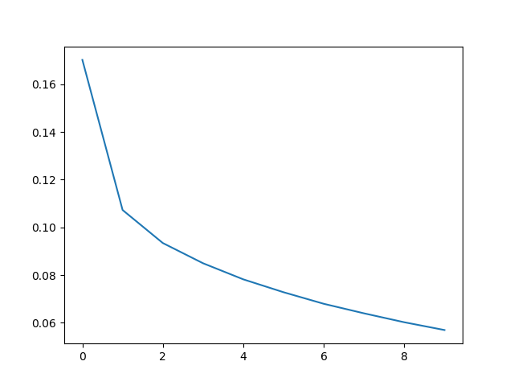

# Assignment 3: Written Part

## 1. Machine Learning & Neural Networks

### (a) Adams

- i. Momentum:
  - Momentum works as a moving average of the gradient history so that the gradient will change more smoothly.
  - On one hand, it will fasten convergence. On the other hand, it will help the model get rid of local minimum.
- ii. Adagrad:
  - adaptive learning rate for each parameter individually
  - parameters changing frequently will receive less gradient
  - parameters changing less frequently otherwise

### (b) Dropout

- i. Training:
  - $\gamma = 1 / p$
  - during training we always want to keep the parameters' variance from each layer to be normal, or it will be harmful for gradient propgation
- ii. Testing:
  - dropout in training works as a regularization method and can also be seen as an average of many models
  - but we don't want randomness in testing but we still need to keep the expectation same

## 2. Neural Transition-Based Dependency Parsing

### (a) parse handfully

| Stack                          | Buffer                                 | New dependency      | Transition | step |
| ------------------------------ | -------------------------------------- | ------------------- | ---------- | ---- |
| [ROOT]                         | [I, parsed, this, sentence, correctly] |                     | Init       | 0    |
| [ROOT, I]                      | [parsed, this, sentence, correctly]    |                     | Shift      | 1    |
| [ROOT, I, parsed]              | [this, sentence, correctly]            |                     | Shift      | 2    |
| [ROOT, parsed]                 | [this, sentence, correctly]            | I <- parsed         | Left-Arc   | 3    |
| [ROOT, parsed, this]           | [ sentence, correctly]                 |                     | Shift      | 4    |
| [ROOT, parsed, this, sentence] | [correctly]                            |                     | Shift      | 5    |
| [ROOT, parsed, sentence]       | [correctly]                            | this <- sentence    | Left-Arc   | 6    |
| [ROOT, parsed]                 | [correctly]                            | parsed -> sentence  | Right-Arc  | 7    |
| [ROOT, parsed, correctly]      | []                                     |                     | Shift      | 8    |
| [ROOT, parsed]                 | []                                     | parsed -> correctly | Right-Arc  | 9    |
| [ROOT]                         | []                                     | Root -> parsed      | Right-Arc  | 10   |

### (b) time complexity

- It will be parsed in 2n steps——linear time complexity
- for each word in the sentence, it needs to be SHIFT into the stack once and be Arced once.

### (e) result

- best UAS on the dev set: 88.80%
- UAS on the test set: 89.17%

### (f) find mistakes

- Verb Phrase Attachment Error:
  - Incorrect dependency: wedding -> fearing
  - Correct dependency: disembarked -> fearing

- Coordination Attachment Error:
  - Incorrect dependency: makes -> rescue
  - Correct dependency: rush -> rescue

- Prepositional Phrase Attachment Error:
  - Incorrect dependency: named -> Midland
  - Correct dependency: guy -> Midland
- Modier Attachment Error:
  - Incorrect dependency: elements -> most
  - Correct dependency: crucial -> most